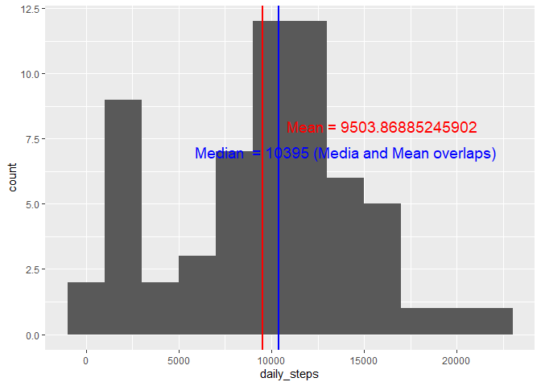

## load libiary


```
## 
## Attaching package: 'dplyr'
```

```
## The following objects are masked from 'package:stats':
## 
##     filter, lag
```

```
## The following objects are masked from 'package:base':
## 
##     intersect, setdiff, setequal, union
```

```
## 
## Attaching package: 'data.table'
```

```
## The following objects are masked from 'package:dplyr':
## 
##     between, first, last
```


## Loading and preprocessing the data (Remove NAs)


```r
unzip(zipfile = "activity.zip", exdir = getwd())

dt <- read.table("activity.csv", na.strings = "NA", sep = "," , header = T)

dt <- dt[complete.cases(dt),]

dt$date <- as.Date(dt$date, format = "%Y-%m-%d")
```


## What is mean total number of steps taken per day?

### Aggreated date by Days


```r
totalStepbyDay <- aggregate(dt$steps, by=list(date = dt$date), FUN = sum)

colnames(totalStepbyDay)[2] <- "daily_steps"

# print summary of daily steps
summary(totalStepbyDay$daily_steps)
```

```
##    Min. 1st Qu.  Median    Mean 3rd Qu.    Max. 
##      41    8841   10765   10766   13294   21194
```
### Draw the histgram, Median and Mean lines (Median and Mean are overlapping)


```r
library(ggplot2)
# Basic histogram
myplot <- ggplot(totalStepbyDay, aes(daily_steps)) + geom_histogram(binwidth=2000)

myplot + 
  
  geom_vline(xintercept = mean(totalStepbyDay$daily_steps),        # Add line for mean
             col = "red",
             lwd = 3) + 
  
  annotate("text",                        # Add text for mean
           x = 16000,
           y = 8,
           label = paste("Mean =", mean(totalStepbyDay$daily_steps)),
           col = "red",
           size = 5) + 
  
  geom_vline(xintercept = median(totalStepbyDay$daily_steps),        # Add line for mean
             col = "blue",
             lwd = 1) +

    annotate("text",                        # Add text for mean
           x = 14000,
           y = 7,
           label = paste("Median  =", median(totalStepbyDay$daily_steps),"(Media and Mean overlaps)"),
           col = "blue",
           size = 5)
```

<!-- -->


## What is the average daily activity pattern?

### aggregate data by 5min interval 


```r
dailyStepInterval <- aggregate(dt$steps, by=list(dailyInterval = dt$interval), FUN = sum)

colnames(dailyStepInterval)[2] <- "daily_steps"
```

### Plot interval and total steps


```r
ggplot(data=dailyStepInterval, 
       aes(x=dailyInterval, 
           y=daily_steps, group=1)) +
            labs(x = "5 min interval")+
  
            geom_line()+
            geom_point()
```

<!-- -->


## Imputing missing values

### Checking NA in orignal data set


```r
#read in original dt
dirtydt <- read.table("activity.csv", na.strings = "NA", sep = "," , header = T)

summary(dirtydt)
```

```
##      steps            date              interval     
##  Min.   :  0.00   Length:17568       Min.   :   0.0  
##  1st Qu.:  0.00   Class :character   1st Qu.: 588.8  
##  Median :  0.00   Mode  :character   Median :1177.5  
##  Mean   : 37.38                      Mean   :1177.5  
##  3rd Qu.: 12.00                      3rd Qu.:1766.2  
##  Max.   :806.00                      Max.   :2355.0  
##  NA's   :2304
```


### Replace NA with interval-median (2304 NA in "setpes" accroding to summary)


```r
# Create a table with interval and medial of steps 
interMedian <- aggregate(dt$steps, by=list(interval = dt$interval), FUN = median)

colnames(interMedian)[2] <- "steps"

# keep the dirty data, just for comparision
tempCol <- dirtydt$steps
dirtydt$OrgStep <- tempCol

# left join dirty table with interMedian on interval
# replace steps in dirtydt with NA with steps in interMedian table
# remove -steps.y, -steps.x 
temptbl <- left_join(dirtydt,interMedian, by = "interval") %>% 
        mutate(steps = ifelse(is.na(steps.x), steps.y, steps.x)) %>%
        select(-steps.y, -steps.x) 


totalStepbyDay1 <- aggregate(temptbl$steps, by=list(date = temptbl$date), FUN = sum)

colnames(totalStepbyDay1)[2] <- "daily_steps"


str(dirtydt)
```

```
## 'data.frame':	17568 obs. of  4 variables:
##  $ steps   : int  NA NA NA NA NA NA NA NA NA NA ...
##  $ date    : chr  "2012-10-01" "2012-10-01" "2012-10-01" "2012-10-01" ...
##  $ interval: int  0 5 10 15 20 25 30 35 40 45 ...
##  $ OrgStep : int  NA NA NA NA NA NA NA NA NA NA ...
```


### plot for imputed NA data

```r
myplot1 <- ggplot(totalStepbyDay1, aes(daily_steps)) + geom_histogram(binwidth=2000)

myplot1 + 
  
  geom_vline(xintercept = mean(totalStepbyDay1$daily_steps),        # Add line for mean
             col = "red",
             lwd = 1) + 
  
  annotate("text",                        # Add text for mean
           x = 16000,
           y = 8,
           label = paste("Mean =", mean(totalStepbyDay1$daily_steps)),
           col = "red",
           size = 5) + 
  
  geom_vline(xintercept = median(totalStepbyDay1$daily_steps),        # Add line for mean
             col = "blue",
             lwd = 1) +

    annotate("text",                        # Add text for mean
           x = 14000,
           y = 7,
           label = paste("Median  =", median(totalStepbyDay1$daily_steps),"(Media and Mean overlaps)"),
           col = "blue",
           size = 5)
```

<!-- -->


## Are there differences in activity patterns between weekdays and weekends?
