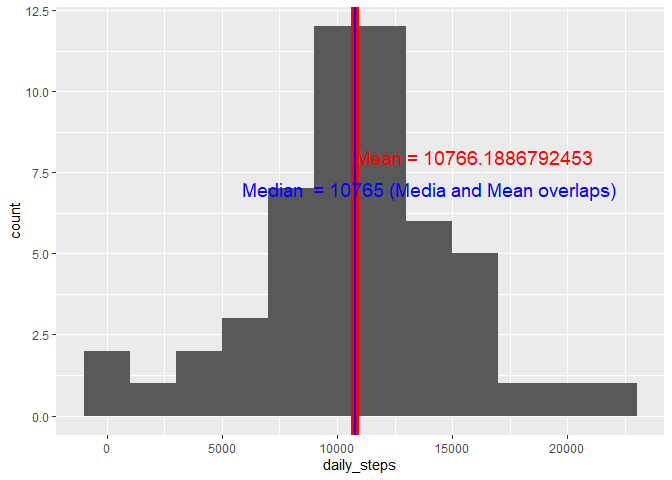

## load libiary


```
## 
## Attaching package: 'dplyr'
```

```
## The following objects are masked from 'package:stats':
## 
##     filter, lag
```

```
## The following objects are masked from 'package:base':
## 
##     intersect, setdiff, setequal, union
```

```
## 
## Attaching package: 'data.table'
```

```
## The following objects are masked from 'package:dplyr':
## 
##     between, first, last
```


## Loading and preprocessing the data (Remove NAs)


```r
unzip(zipfile = "activity.zip", exdir = getwd())

dt <- read.table("activity.csv", na.strings = "NA", sep = "," , header = T)

dt <- dt[complete.cases(dt),]

dt$date <- as.Date(dt$date, format = "%Y-%m-%d")
```


## What is mean total number of steps taken per day?

### Aggreated date by Days


```r
totalStepbyDay <- aggregate(dt$steps, by=list(date = dt$date), FUN = sum)

colnames(totalStepbyDay)[2] <- "daily_steps"

# print summary of daily steps
summary(totalStepbyDay$daily_steps)
```

```
##    Min. 1st Qu.  Median    Mean 3rd Qu.    Max. 
##      41    8841   10765   10766   13294   21194
```
### Draw the histgram, Median and Mean lines (Median and Mean are overlapping)


```r
library(ggplot2)
# Basic histogram
myplot <- ggplot(totalStepbyDay, aes(daily_steps)) + geom_histogram()

myplot + 
  
  geom_vline(xintercept = mean(totalStepbyDay$daily_steps),        # Add line for mean
             col = "red",
             lwd = 3) + 
  
  annotate("text",                        # Add text for mean
           x = 16000,
           y = 8,
           label = paste("Mean =", mean(totalStepbyDay$daily_steps)),
           col = "red",
           size = 5) + 
  
  geom_vline(xintercept = median(totalStepbyDay$daily_steps),        # Add line for mean
             col = "blue",
             lwd = 1) +
  

    annotate("text",                        # Add text for mean
           x = 14000,
           y = 7,
           label = paste("Median  =", median(totalStepbyDay$daily_steps),"(Media and Mean overlaps)"),
           col = "blue",
           size = 5)
```

```
## `stat_bin()` using `bins = 30`. Pick better value with `binwidth`.
```

<!-- -->


## What is the average daily activity pattern?

### aggregate data by 5min interval 


```r
dailyStepInterval <- aggregate(dt$steps, by=list(dailyInterval = dt$interval), FUN = sum)

colnames(dailyStepInterval)[2] <- "daily_steps"
```

### Plot interval and total steps


```r
ggplot(data=dailyStepInterval, 
       aes(x=dailyInterval, 
           y=daily_steps, group=1)) +
            labs(x = "5 min interval")+
  
            geom_line()+
            geom_point()
```

<!-- -->


## Imputing missing values


## Are there differences in activity patterns between weekdays and weekends?
